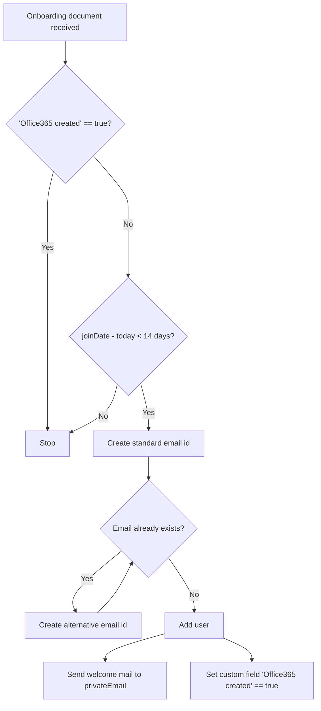

# HRWorks - Office365 Sync

This project lifts the burden of manually creating new user accounts in Office365 for joining employees.
To do this, it browses the recent [Onboarding Documents] of HRworks and then creates the users.

## Flow

1. Authentication using a `POST` against `/authentication` using environment variables `API_ACCESS_KEY_ID` and `API_ACCESS_KEY_SECRET`.
   This returns a jwt token that is valid for 15 mins.

2. `GET /onboarding`: This will receive all the onboarding documents.

**TO-DO**: Check for the `stausFilter` query parameter. It could effectively restrict the number of returned documents and improve performance. Question: What if onboarding document isn't filled until employees join?

3. Process the `onboarding document`

